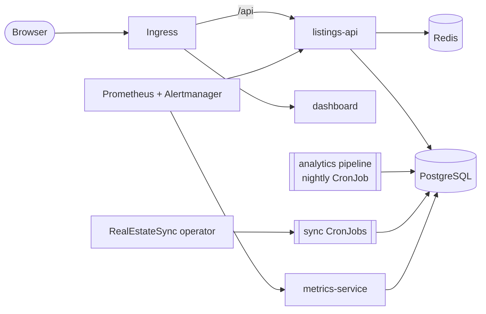

# KubeEstateHub

[](https://github.com/SatvikPraveen/KubeEstateHub/actions/workflows/ci.yaml)
[](https://github.com/SatvikPraveen/KubeEstateHub/actions/workflows/kubernetes.yaml)
[](https://github.com/SatvikPraveen/KubeEstateHub/actions/workflows/images.yaml)
[](https://github.com/SatvikPraveen/KubeEstateHub/actions/workflows/security.yaml)
[](LICENSE)

**A cloud-native platform for statistically validated real-estate market analytics on
Kubernetes.** It combines production-grade platform engineering with reproducible
research:

* **Services:** a listings API, a dashboard, a batch analytics pipeline, a
  model-quality exporter and a custom operator.
* **Operations:** SLOs with burn-rate alerting, policy-as-code and zero-trust networking.
* **Supply chain:** signed images and CI where every check gates.
* **Analytics:** market trends come with significance tests, valuations come with
  prediction intervals that have a finite-sample coverage guarantee, and every number
  can be traced to the code version, seed and parameters that produced it.

## Highlights

| | |
|---|---|
| **Hedonic price index** | Log-linear hedonic model with HC1 errors, Duan smearing and a Kennedy-corrected time-dummy index |
| **Trend detection** | Theil–Sen slope with Sen's CI plus the Mann–Kendall test. The v1 ±5% rule flagged 62–74% of *flat* markets as trending; the new classifier flags about 9% |
| **Valuation uncertainty** | Split-conformal intervals: 0.902 empirical coverage against 0.90 nominal over 50 Monte Carlo markets |
| **Accuracy** | Cross-validated median APE of 8.2%, at the theoretical noise floor of about 8.1% |
| **Provenance** | A `model_runs` row per pipeline run, referenced by every trend, index point and valuation |
| **Operator** | `RealEstateSync` custom resource reconciled into owned, hardened CronJobs, with status and drift repair (kopf) |
| **SLOs** | 99.5% availability and 99% ≤ 500 ms, multi-window burn-rate alerts, conformal-coverage drift alerts, all tested with promtool |
| **Security** | PSA `restricted`, default-deny NetworkPolicies, CEL ValidatingAdmissionPolicy, least-privilege RBAC, External Secrets, and cosign, SBOM and SLSA provenance on images |
| **Verification** | 118 unit tests, PostgreSQL integration tests, 20 policy tests, promtool tests, kubeconform, kube-linter and conftest on 8 renders, a Helm/kustomize parity check, and compose and kind end-to-end tests |

Full numbers and how to reproduce them: [docs/research/results.md](docs/research/results.md).

## Architecture



Details: [docs/architecture.md](docs/architecture.md) and the [ADRs](docs/adr/README.md).

## Quick start

```bash
make up               # docker compose: migrate, seed a synthetic market, run the pipeline
open http://localhost:3000
make e2e              # 13 end-to-end checks on a fresh stack
make kind-e2e         # the same platform on a real Kubernetes cluster (kind)
```

Other paths, including Helm, kustomize and an existing cluster, are in
[docs/getting-started.md](docs/getting-started.md).

## Repository layout

```
src/
  listings-api/              Flask API (pydantic, OpenAPI 3.1, RFC 9457, RED metrics)
  analytics-worker/          statistics, hedonic/conformal models, pipeline, feed sync, benchmark
  metrics-service/           scrape-time business and model-quality exporter
  frontend-dashboard/        static dashboard on nginx-unprivileged
  realestate-sync-operator/  kopf operator
db/                          versioned, checksummed SQL migrations and runner
manifests/                   kustomize base and components (monitoring, operator, admission-policy, backup)
kustomize/overlays/          development, staging, production, e2e
helm-charts/kubeestatehub/   self-contained chart, in parity with the production overlay
policy/                      conftest policies (Rego v1) and their tests
observability/               Prometheus rules + promtool tests, Grafana dashboards
platform/                    pinned cluster prerequisites (helmfile)
experiments/chaos/           Chaos Mesh experiments with SLO-linked hypotheses
tests/                       unit, integration, load (k6)
hack/                        generate, validate, kind-e2e, tool installer, studies
docs/                        architecture, research, operations, security, ADRs
```

## Documentation

* [Statistical methodology](docs/research/methodology.md)
* [Validation results](docs/research/results.md)
* [SLOs](docs/research/slo.md)
* [Runbooks](docs/operations/runbooks.md)
* [Threat model](docs/security/threat-model.md)
* [Contributing](CONTRIBUTING.md)
* [Changelog](CHANGELOG.md)

## Citing

If you use KubeEstateHub or its validation results, please cite it using
[CITATION.cff](CITATION.cff).

## License

[MIT](LICENSE)
