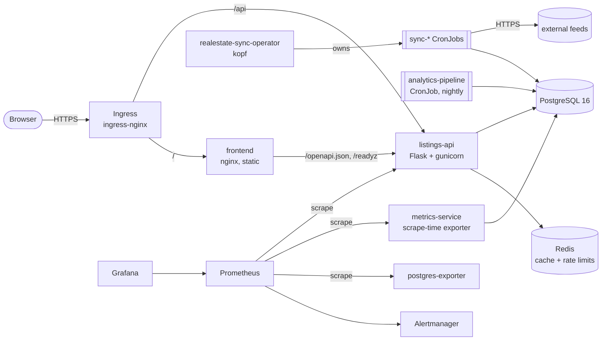
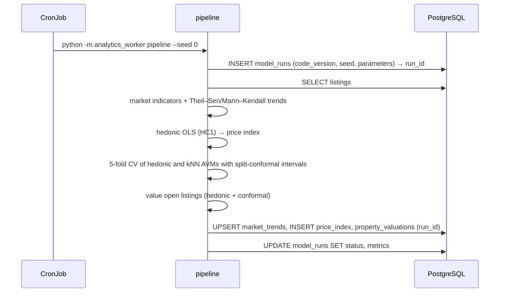

# Architecture

## Components

| Component | Responsibility | State |
|---|---|---|
| listings-api | REST API for listings, market indicators and model provenance; OpenAPI; RED metrics | stateless |
| frontend | Static dashboard; proxies `/openapi.json` and `/readyz` | stateless |
| analytics-pipeline | Nightly batch: market trends, hedonic index, AVM cross-validation, valuations of open listings, all written with provenance | none (writes to PostgreSQL) |
| realestate-sync-operator | Reconciles `RealEstateSync` custom resources into owned CronJobs that ingest external feeds | none (status stored on the CR) |
| metrics-service | Exports business and model-quality metrics computed at scrape time | in-memory TTL cache |
| PostgreSQL | System of record, with versioned, checksummed migrations | persistent |
| Redis | Response cache and rate-limit counters; safe to lose | ephemeral |

## Request path

1. The Ingress routes `/api/*` to the listings API. Everything else goes to the dashboard.
2. The API validates input with pydantic and rejects unknown parameters. Reads are served
   through the Redis cache, whose keys embed a generation number that writes increment.
3. SQL is always parameterised. A 5 s statement timeout bounds tail latency.
4. Errors are RFC 9457 problem documents that carry the request ID.
5. Readiness requires a reachable database and the schema version the build needs.
   Liveness requires only a live process.

## Batch path (analytics)

A failed run is recorded with its error and does not overwrite previous results. The API
always serves the latest successful run.

## Operator reconcile loop

`RealEstateSync` spec → `build_cronjob` (a pure function) → create or replace an owned
CronJob that runs `analytics_worker sync`. A 60 s timer mirrors the CronJob status into
`.status` and recreates the CronJob if it was deleted. Deleting the custom resource
garbage-collects the CronJob through its ownerReference. See
[`src/realestate-sync-operator`](../src/realestate-sync-operator/README.md).

## Deployment and security posture

* **Packaging.** One kustomize base plus optional components (monitoring, operator,
  admission policy, backup), and a Helm chart that renders the same resources. CI checks
  the parity.
* **Pod security.** The namespace enforces the Pod Security Standard `restricted`. Every
  pod runs non-root with a read-only root filesystem, no capabilities, a RuntimeDefault
  seccomp profile and no service-account token (except the operator). UIDs/GIDs are above
  10000 except the PostgreSQL server, which keeps the image's built-in UID 70. Every
  container sets CPU and memory requests and limits; a LimitRange supplies bounded
  defaults and a ResourceQuota caps the namespace (both checked by `policy/combined.rego`).
* **Network.** Default-deny NetworkPolicies, with explicit ingress and egress per flow.
* **Admission.** A CEL ValidatingAdmissionPolicy enforces pinned images, read-only root
  filesystems, memory limits and CPU requests.
* **Supply chain.** Images are multi-arch, scanned by Trivy, carry an SBOM and SLSA
  provenance, and are signed keylessly with cosign. CI actions are pinned by SHA.

See [security/threat-model.md](security/threat-model.md) and the ADRs in [adr/](adr/).
